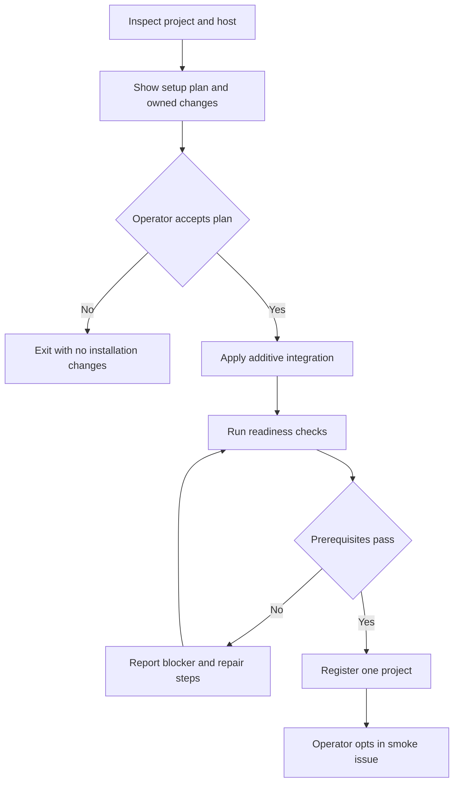
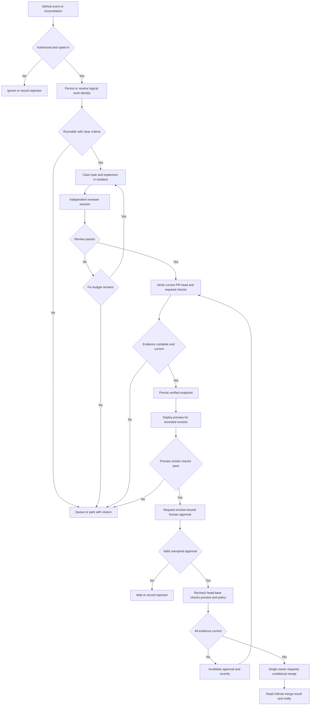
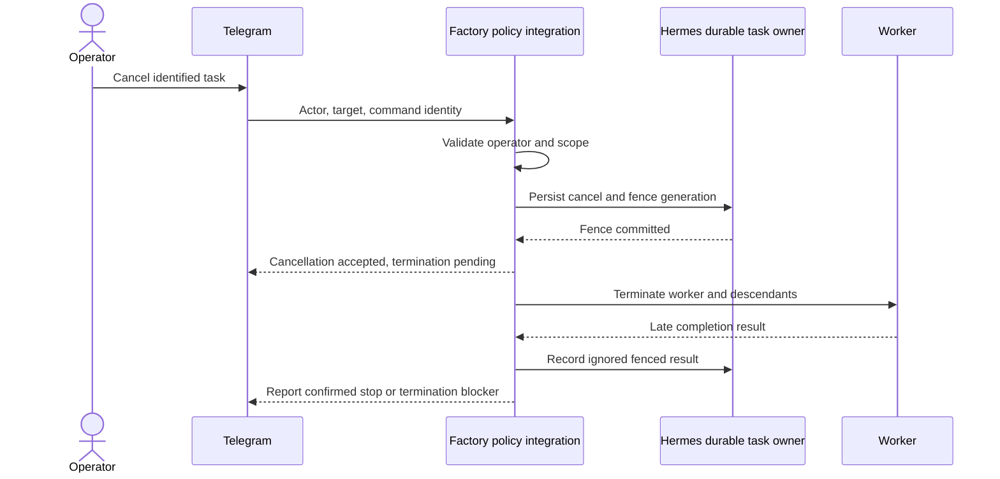
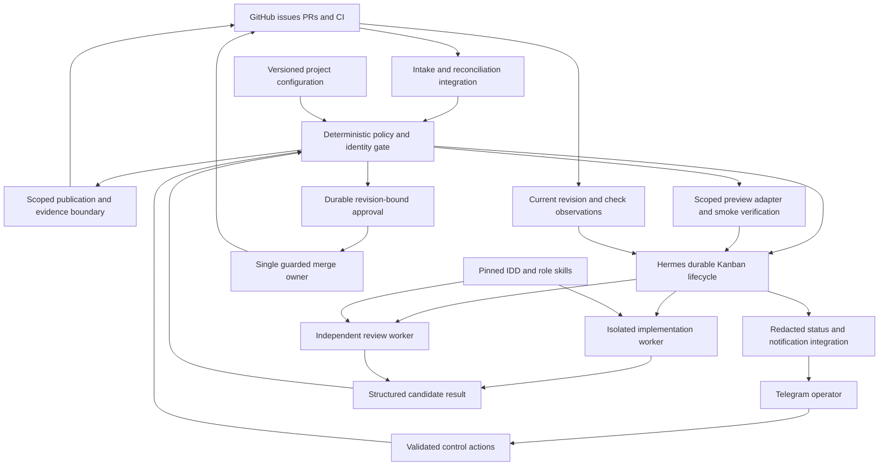

# Product Requirements Document: factory-kit

> Source: idea.md, validate.md
> Generated: 2026-10-04
> Version: 1.0
> Status: Draft for implementation review — MVP endpoint and internal compliance scope confirmed
> Owner: Luong; solo, bootstrapped implementation

## 1. Product Overview

### 1.1 Vision and evidence

Source: idea.md describes an installable, skills-driven engineering workflow that lets Luong operate existing GitHub projects through Hermes and Telegram while reusing IDD and local coding tools. factory-kit should reduce the work of installing, supervising, and recovering that workflow. GitHub owns code and delivery evidence; Hermes owns task execution; Telegram provides human control.

The confirmed direction is a Hermes-native, Telegram-first local kit. The confirmed horizon is a narrow MVP built by one person in 2–4 weeks, followed by reliable internal use and eventual open-source adoption over 6–12 months. The working product name remains `factory-kit`.

[Validation](validate.md) returned **Maybe**: creativity 5/10, feasibility 7/10, market impact 5/10, and proposed technical execution 6/10. These are qualitative assessments. No integration, customer adoption, or reliability result has been demonstrated. Proceed first through the bounded integration spike in §8.

### 1.2 Target users and business objectives

The initial user is Luong maintaining existing GitHub projects with IDD, skills, Hermes, and Telegram. The next segment is similarly equipped solo developers and small OSS-maintainer teams. Broad enterprise governance and managed hosting are outside the initial target.

The business model is an open-source utility funded as a side project. Revenue is not an MVP success criterion. Paid installation/support or hosting remain hypotheses to revisit after repeat external usage. The distribution license remains an explicit release decision; existing subscription access does not establish unlimited usage or an approved automated workload.

Objectives are to preserve project conventions, produce traceable review evidence, recover predictably from interruptions, and save operator time relative to direct IDD/manual coordination. Do not build a second scheduler, general agent dashboard, or new skills engine.

### 1.3 Scope and decision status

The shared MVP core is one existing repository, one supported worker runtime, one active issue, isolated workspaces, independent review, existing CI, and Telegram supervision. Automatic execution requires explicit issue opt-in by an authorized operator. A signature on a webhook is not authorization to execute its text.

**User-selected MVP endpoint (2026-10-04): preview verification, revision-bound human approval, and merge.** The user selected this over validation’s smaller verified-PR recommendation. One preview provider and one merge method must be proven in the spike. Factory policy owns the only automated merge path; the human owns approval. Production deployment, package publication, arbitrary external-harness support, and concurrent multi-project execution remain deferred. The existing 2–4-week target is at risk from this expansion; do not silently drop preview/merge or weaken gates to meet it. If supported boundaries or the selected project cannot meet the scope, return an explicit replan to the owner.

### 1.4 Success Metrics

All numerical targets below are proposed acceptance targets, not achieved results or previously confirmed commitments. T0 is the agreed implementation start; public-pilot timing depends on passing the internal gates.

| Metric | Target and timeframe | Measurement |
|---|---|---|
| Spike viability | 1 complete opted-in issue-to-preview-to-approved-merge run within 2 working days of T0 | Durable task, independent review, current-head checks, preview evidence, revision-bound approval, merge read-back and supported integration path |
| Completion correctness | 100% of runs marked verified contain matching PR-head, review and required-check evidence by MVP release, within 4 weeks of T0 | Audit every verified outcome; zero unknown or stale results counted as passing |
| Recovery correctness | 0 duplicate PRs, 0 unauthorized merges and 0 accepted fenced results across every §8 fault scenario, repeated 3 times each before MVP release within 4 weeks of T0 | Deterministic fault-injection log with task, attempt and remote identities |
| Internal usefulness | At least 8 of 10 scoped issues reach a preview-verified, merge-ready PR, and at least 3 are human-approved and merged within 30 days of MVP release, across 2 sequential project registrations | Preselect bounded issues; include blocked/failed cases in the denominator, record human declines separately and report task mix |
| Operator time | At least 25% lower median intervention minutes per issue than a 10-issue comparable baseline within 30 days of MVP release | Human-recorded active intervention time; include failures and amortized setup/maintenance time separately |
| External onboarding | 3 external maintainers complete installation and a first run within 60 days of pilot opening; at least 2 complete setup in 45 minutes without author takeover | Observed setup duration, prerequisites and assistance recorded |
| Repeat adoption | 2 external maintainers complete at least 1 run per week for 4 consecutive weeks within 90 days of pilot opening | Opt-in participant reports, including failed runs; not inferred from stars/downloads |

Small cohorts guide a continue/narrow/stop decision; they do not establish security or product-market fit.

## 2. User Personas

These are design personas derived from the input audience, not interview findings. Quotes are representative illustrations.

### Persona 1 — Luong, solo project maintainer

- **Name:** Luong.
- **Role:** Technical builder maintaining several GitHub projects with IDD and local agents; the first operator and product owner.
- **Goals:** Delegate bounded issues, check progress from Telegram, and return to reviewable evidence without reconstructing lost sessions.
- **Pain Points:** Repeated setup, manual handoffs, stale CI/review results, interrupted workers, and uncertainty about subscription usage.
- **Journey:** Register one existing project, opt in an issue, inspect status, handle a blocker, and assess the resulting PR.
- **Quote:** “Tell me what ran, what revision was checked, and what still needs me.”

### Persona 2 — Alex, external OSS maintainer

- **Name:** Alex (illustrative).
- **Role:** Maintainer of a small repository with established CI and contributor conventions.
- **Goals:** Try the kit without replacing CI, protect contributor work, and uninstall cleanly if it adds maintenance burden.
- **Pain Points:** Broad tokens, invasive setup scripts, duplicated PRs, agent output that claims success without evidence, and hidden dependency drift.
- **Journey:** Inspect the support matrix and proposed setup diff, run diagnostics, try a small issue, then evaluate repeat use.
- **Quote:** “Show me the changes and prove I can remove them without breaking my project.”

### Persona 3 — Sam, reviewer and co-maintainer

- **Name:** Sam (illustrative).
- **Role:** Human reviewer sharing responsibility for a small OSS project; not necessarily the host operator.
- **Goals:** Review understandable changes and distinguish verified evidence from incomplete or superseded results.
- **Pain Points:** Conflicting automation, outdated approvals, excessive notifications, and unclear accountability after cancellation.
- **Journey:** Open the linked PR, inspect the exact SHA and review/check evidence, request changes, and use the repository's established delivery process.
- **Quote:** “I need to know which checks apply to the code I am reviewing.”

## 3. Feature Requirements

### 3.1 MoSCoW matrix

Must features F01–F08 and F11–F12 gate the internal MVP. Should features F09–F10 target the onboarding pilot and may be deferred explicitly without weakening Must requirements.

| ID | Feature | Priority | User story | Dependencies |
|---|---|---|---|---|
| F01 | Additive setup and readiness | Must | As an operator, I want a reviewable setup diff and verified prerequisites so I can adopt the kit safely. | Supported Hermes integration established by spike |
| F02 | Authorized durable intake | Must | As a maintainer, I want only opted-in work accepted once so retries do not create extra work. | F01, configured repository/operator identity |
| F03 | One bounded IDD execution lane | Must | As an operator, I want one isolated issue attempt with explicit limits so resource use stays bounded. | F02, supported runtime readiness |
| F04 | Independent review and current-head verification | Must | As a reviewer, I want review and CI tied to one SHA so I can assess the actual result. | F03, explicit verification contract |
| F05 | Telegram status, pause and cancellation | Must | As an operator, I want attributable control and truthful status away from my workstation. | F01, durable task/control records |
| F06 | Restart recovery and reconciliation | Must | As an operator, I want interrupted work recovered or parked without duplicate publication. | F02–F05, Hermes lifecycle boundaries |
| F07 | Evidence, usage and diagnostic records | Must | As a maintainer, I want inspectable evidence and honest usage reporting so I can understand outcomes and costs. | F02–F06 |
| F08 | Safe removal and configuration ownership | Must | As an adopter, I want uninstall to preserve unrelated files and my edits. | F01, installation ownership inventory |
| F09 | Checkpointed scope steering | Should | As an operator, I want revised instructions applied to the next bounded attempt without reviving an obsolete worker. | F05–F06 |
| F10 | Versioned upgrade/repair and pilot recipes | Should | As an external maintainer, I want known compatible versions and reversible upgrades. | F01, F08, measured MVP reliability |
| F11 | Revision-bound preview verification | Must | As a maintainer, I want to inspect a tested preview of the proposed change before approving merge. | F04, one selected provider and scoped preview credentials |
| F12 | Durable human approval and guarded merge | Must | As an operator, I want approval to authorize only the verified revision so later changes cannot inherit permission. | F05–F07, F11, enforced GitHub protections |
| F13 | One additional supported harness adapter | Could | As a user, I want another runtime when it passes the same lifecycle tests. | Pilot gate and adapter-specific readiness/fault tests |
| F14 | Production promotion, autonomous merge and parallel projects | Won't | Deferred capabilities require separate policy, isolation and delivery evidence. | Separate future PRD and acceptance gates |

### 3.2 Acceptance criteria and edge cases

#### F01 — Additive setup and readiness

- Given an existing repository with CI, `.gitissue.yml`, and uncommitted developer work / When setup inspects it / Then it proposes only factory-owned additions and explicit integration edits without stashing, resetting, or modifying unrelated work.
- Given the approved setup plan / When installation runs twice / Then the second run creates no duplicate registration, webhook, configuration block, or dependency entry and reports an empty effective diff.
- Given a missing executable, unavailable configured model, failed authentication, conflicting automation owner, or unsupported Hermes version / When readiness runs / Then the specific prerequisite is blocked and no issue is dispatched.
- The report records supported host/runtime versions, permissions, verification commands, skill revisions and cancellation capability. Presence on PATH alone is insufficient. Sensitive or remote setup changes require an explicit, reviewable operator plan; tokens are never committed.

#### F02 — Authorized durable intake

- Given a valid signed event for the registered repository and an issue opted in by an authorized actor / When intake accepts it / Then durable logical work identity is established before it is reported as safely queued.
- Given the same event delivered 100 times, including after restart / When webhook intake and reconciliation overlap / Then they converge on one logical task and at most one active attempt and one linked PR.
- Given an invalid signature, wrong repository, unauthorized label action, revoked opt-in, or an instruction embedded in issue prose / When it reaches intake / Then no new execution authority is granted and the reason is recorded without logging secrets.
- Persist delivery IDs separately from logical work identity. Edits update pending context or mark the active attempt for re-evaluation; they do not silently spawn parallel work. Factory notifications must not create intake loops.

#### F03 — One bounded IDD execution lane

- Given a ready authorized task and a free execution lane / When the controller dispatches it / Then one worker receives an isolated workspace, repository/issue identity, acceptance criteria, pinned skills, model selection, attempt identity and resource limits.
- Given another task arrives during an active task / When scheduling evaluates it / Then it remains durably queued with a visible reason; implementation and review execute sequentially.
- Given the default attempt or time budget is exhausted / When the next action is evaluated / Then work parks with an explanation rather than silently extending its limits or changing provider.
- IDD procedures must run without an independent backlog loop or an implicit auto-merge policy. A missing tool, unusable model or unsupported subdelegation reports a blocker. Default limits: one active task, two implementation attempts total (initial plus one fix attempt), and 60 minutes of active worker execution per task across roles. Operator-requested retries are new audited generations with fresh authorization; they do not hide previous usage.

#### F04 — Independent review and current-head verification

- Given an implementation result at SHA A / When review starts / Then a separate reviewer session inspects the diff against the issue criteria and records its own verdict, findings and SHA A.
- Given positive review, successful required checks and a linked open PR at SHA A / When the controller evaluates completion / Then it reads GitHub, verifies the head still equals A, and records the PR, head/base SHA, review, check identities and observation time.
- Given the head changes to SHA B, a required check fails/is missing, or GitHub is unavailable / When completion is evaluated / Then the result is stale, failed or unknown respectively and cannot be called verified.
- Given a reviewer requests changes / When the task has budget remaining / Then one bounded fix attempt is permitted and all revision-dependent review/check evidence is rebuilt; otherwise the task parks.
- Define required checks during setup from repository protection plus explicit project acceptance commands. A repository with no protected checks still needs a nonempty operator-approved verification contract. Skipped/neutral checks count only if the contract explicitly permits that conclusion. A green exit code from the worker is never the completion contract.
- A verified PR is a point-in-time observation, not a merge guarantee. Later observed changes mark evidence stale; status always displays the verified SHA and observation time. Human-authored commits are never overwritten to restore an old result.

#### F05 — Telegram status, pause and cancellation

- Given a message from an allowed numeric Telegram actor in the configured conversation / When a recognized status or control action is submitted / Then the system persists its actor, repository, task/generation, action and result and returns an attributable acknowledgement.
- Given a pause request / When the current stage finishes / Then the next stage does not start until an authorized resume; status distinguishes pause requested from paused.
- Given a cancellation request / When it is accepted / Then the active generation is fenced before process termination begins, new effects are denied, and late results cannot advance state.
- Given a forged operator, ambiguous target, duplicate command or unsupported request / When it is processed / Then the controller rejects or requests clarification without broadening permissions or repeating the action.
- Structured status/pause/resume/cancel commands are the required baseline; their exact syntax remains a design decision. Natural-language interpretation may propose the same validated actions, but prose cannot bypass policy. Cancellation acknowledges fencing separately from confirmed process exit. Effects already committed before cancellation are reported with links; they are not silently undone.

#### F06 — Recovery and reconciliation

- Given the host stops after durable acceptance but before dispatch / When Hermes restarts / Then the task resumes or parks through supported lifecycle ownership without depending on Telegram history.
- Given a crash after PR creation but before its response is recorded / When recovery reconciles / Then it locates the existing PR through the recorded work identity before attempting any creation and parks on ambiguous remote state.
- Given a lease expires or a worker becomes unreachable / When recovery runs / Then the old generation is fenced before replacement work is eligible; late output cannot be accepted.
- Given GitHub returns a rate limit or network error / When reconciliation retries / Then it uses bounded backoff, honors available retry guidance, reports stale/unknown state and performs no blind repeat mutation.
- Periodic reconciliation recovers missed events and revoked permissions using GitHub state. An unexpected terminal PR state, human branch movement, or irreconcilable identity requires a visible parked state rather than a new PR.

#### F07 — Evidence, usage and diagnostics

- Given a task reaches a terminal or waiting state / When status is requested / Then it includes task/attempt identity, outcome, current blocker, relevant revision, PR/check references, elapsed worker time and remaining limits.
- Given the runtime exposes token or monetary usage / When the result is recorded / Then measured values retain provider/unit attribution; unavailable usage is `unknown`, never zero or an invented currency estimate.
- Given diagnostic export includes seeded credentials or private issue content / When it is generated / Then credential canaries are absent and content bodies are excluded by default, with explicit operator selection for any expanded export.
- Persist an append-only event trail within the supported durability design. Correction events supersede old evidence without rewriting its history. Notifications contain short summaries and authorized links, not raw code, tokens or full logs.

#### F08 — Removal and ownership

- Given a completed installation and unrelated repository content / When the operator reviews and applies uninstall / Then only recorded factory-owned integrations/files are eligible for removal and unrelated content remains byte-for-byte unchanged.
- Given a factory-created file has since been edited by the user / When uninstall runs / Then it preserves the file or requests a specific reviewed resolution instead of deleting those edits.
- Given an active or unconfirmed worker / When uninstall begins / Then intake stops, the worker is fenced and termination is resolved or surfaced before credentials/state are removed; active worktrees are not forcibly deleted.
- Retain/export or delete task history through an explicit choice. Removing a registration must not remove shared Hermes infrastructure, IDD configuration, shared skills or tokens used elsewhere.

#### F09 — Checkpointed steering

- Given an authorized scope change for an active task / When steering is accepted / Then it is stored with the target generation, the old attempt is fenced at a supported boundary, and any replacement receives the revised criteria and remaining explicit budget.
- Given the configured runtime lacks live steering / When the user requests it / Then the system explains checkpoint/restart behavior without claiming live injection or enabling an unsupported harness.

#### F10 — Versioned upgrade and repair

- Given a supported installed version / When upgrade is planned / Then the operator can inspect compatibility checks, changed owned files and rollback instructions before application.
- Given an interrupted migration or a user-edited configuration / When repair runs / Then it either restores a validated checkpoint or parks with a specific conflict, preserves user edits and does not dispatch from a partially migrated configuration.
- Publish a reproducible support recipe, pinned dependency/skill references, known limits and an independent-install walkthrough before the external pilot.

#### F11 — Revision-bound preview verification

- Given an independently reviewed PR with passing required checks / When preview deployment runs / Then the selected provider returns a deployment identity and URL attributable to the recorded head/base and immutable source or artifact identity; worker self-report alone is insufficient.
- Given that deployment / When the configured smoke checks pass / Then the controller records the checks, observation time and deployment identity and makes that evidence available in the approval request.
- Given a failed smoke check, unavailable provider, mismatched SHA, expired deployment or unknown artifact identity / When preview verification is evaluated / Then merge stays blocked and no old preview is accepted as evidence for the new change.
- Given a changed head/base or canceled task / When reconciliation runs / Then superseded preview evidence is invalidated and factory-owned resources are eligible for bounded cleanup; late deployment callbacks cannot revive the attempt.
- The initial project must have a meaningful preview. A “not applicable” preview is not an acceptable substitute for the user-selected MVP endpoint. Select one provider and non-production environment during the spike; agree access visibility, synthetic test data and a smoke command/expected result. Default: one active preview per task, 24-hour maximum resource lifetime, and cleanup within 60 minutes of confirmed task termination when the provider is reachable. Provider outages create a visible cleanup backlog rather than a false removal claim. Preview credentials are confined to the scoped deployment boundary, never the coding worker.

#### F12 — Durable human approval and guarded merge

- Given current review, CI and preview evidence / When approval is requested / Then Telegram presents repository/PR, head/base SHA, preview URL and smoke result, merge method and expiry and creates a durable one-use request bound to that action, revision, evidence set and policy digest.
- Given an authorized human approval / When its decision is accepted / Then actor, action, target, issuance and expiry are durably recorded and one merge intent can consume it; repeated buttons/messages cannot authorize additional effects.
- Given changed head/base, changed policy, new failed/missing checks, stale/unhealthy preview, expired approval, revoked operator or a canceled/paused task / When merge eligibility is checked / Then merge is denied and affected approval is invalidated; resume alone does not revive it.
- Given a valid unexpired approval and unchanged evidence / When the single merge owner executes / Then it rechecks GitHub head/base, PR open/non-draft status, mergeability, all required protections/checks and preview health, issues a merge conditional on the expected head, and reports merged only after GitHub read-back records the actual merge commit SHA.
- Given an API timeout after a merge request / When recovery runs / Then it reconciles PR/merge state before any retry and parks if ambiguous; it never infers success from an approval or an HTTP request being sent.
- Approval expires after 60 minutes by default; preview smoke evidence must be at most 10 minutes old at merge. Reverification produces a fresh evidence set and requires a fresh approval. Failed or expired requests remain auditable. Rejected approval leaves the task blocked for the human decision, with no automatic repeated approval prompt.
- Select one GitHub-supported merge method in setup. Require repository protection/rules that enforce the verification contract against an up-to-date base (or equivalent atomic queue enforcement proven in the spike), and use credentials that cannot bypass those rules. If expected-head checks plus enforced protections cannot close the base/check race, mark merge unsupported and fail the spike; read-then-write alone is insufficient. Review/preview must cover the candidate compatible with that current base. Do not enable GitHub auto-merge as a shortcut that can outlive approval expiry.
- Suppress competing IDD/other factory merge automation or refuse readiness until one automated owner is established. A human merge through GitHub remains observable external activity, recorded with its actual actor; do not misattribute it to a factory approval. Workflow cancellation cannot undo a merge accepted before its fence committed. Destructive reversals require a separate human decision.

## 4. User Flows

### 4.1 Install and establish readiness

The operator inspects the current project, reviews the proposed integration, authorizes setup changes, and runs diagnostics. Unsupported prerequisites remain explicit blockers. The first smoke issue requires a separate opt-in; setup is not blanket authorization for the backlog.

### 4.2 Issue to preview, approval and merge

Webhook and polling paths enter the same authorization/deduplication boundary. Missing acceptance criteria park for clarification. Independent review and verification follow implementation, then preview deployment and smoke verification. The operator receives the exact revision and preview evidence before approving. Approval expiry, rejection, stale evidence or missing infrastructure leave a visible waiting/blocked state. Success requires GitHub merge read-back.

### 4.3 Cancel, crash and late completion

On restart, the board and remote GitHub identities determine recovery. Chat messages are not replayed as execution authority. If a remote mutation may already have occurred, recovery reconciles it before retrying.

## 5. Non-Functional Requirements

### 5.1 Performance and reliability targets

Proposed local targets assume one registered repository, one active task, up to 100 pending tasks, and 10,000 retained event records. Measure on the documented pilot host with working dependencies; report GitHub/model/Telegram latency separately. Fault behavior is tested independently of these timing targets.

| Requirement | Target | Verification |
|---|---|---|
| Durable intake response | p95 ≤ 2 seconds from handler receipt to durable accept/reject under 1 event/second sustained for 5 minutes | Instrument boundary; do not acknowledge accepted work before persistence |
| Duplicate burst | 100 repeats within 10 seconds yield 1 logical task and ≤ 1 PR | Burst + restart test |
| Local status | p95 ≤ 1 second to assemble persisted status | 100 local status queries; clearly flag stale remote observations |
| Control action | Persist pause/cancel and fence within 5 seconds of authenticated handler receipt | Timing assertion independent of Telegram network delivery |
| Cancellation termination | Confirm worker and descendant exit within 30 seconds, or quarantine and notify within that window | Test long-running child process; no replacement dispatch while uncertain |
| Reconciliation | Nominal interval ≤ 60 seconds; missed eligible work discovered within 120 seconds after GitHub connectivity returns, absent server-directed backoff | Drop webhook and recover through polling |
| Restart recovery | Recover or explicitly park all known active tasks within 60 seconds of controller readiness | Kill/restart fault suite |
| Idle overhead | 0 model calls during 30 minutes without eligible work or exceptions | Provider-call audit |
| Persistence | 0 lost acknowledged tasks in defined crash tests | Compare acknowledged identity set with recovered state |

No always-on service SLA is promised for a developer-owned host. Offline status, process liveness and last successful reconciliation must be observable. CI waiting does not consume the 60-minute active-worker budget; default total task wall time is 24 hours, after which work parks. Retry backoff has a 5-minute nominal cap unless upstream requires a longer delay.

### 5.2 Security and privacy

Authorization is deterministic and scoped to registered repositories, allowlisted operators and permitted actions. Validate webhook signatures using the configured secret; distinguish payload authenticity from untrusted issue content. Models cannot grant permissions, change policy, or reinterpret a canceled generation as active.

Use isolated workspaces and a documented execution trust boundary. A worktree separates files but is not a sandbox. The internal MVP accepts only issues explicitly selected by the trusted maintainer on trusted project code; external contributor code and tests must not receive privileged credentials. Before expanding to that input class, demonstrate enforceable process/filesystem/network boundaries. Unsupported isolation is a readiness blocker for the affected workload.

Coding and test processes receive no production secrets, controller tokens or unrestricted GitHub mutation credentials. PR/branch publication must cross a scoped, deterministic boundary that checks current generation and authorization. If the supported runtime cannot enforce that boundary, the integration spike fails; prompt instructions alone cannot establish cancellation safety. Branch protection is not a substitute for guarding every permitted write.

Keep secrets outside the manifest in the host's configured secret mechanism with least-privilege file access. Verify service transport security, redact known credentials before logs/Telegram, and use secret canaries in export/notification tests. Recheck authorization before dispatch and privileged mutations; revocation stops future authority and is reconciled visibly.

Default proposed retention is 7 days for worker logs and 30 days after task completion for detailed audit metadata, configurable before pilot use. Cleanup must preserve active-task records and enough work/remote identity to prevent old webhook replay from recreating work while the registration exists. Keep minimal identity tombstones until explicit registration removal. Export/delete behavior must explain this distinction. No centralized telemetry is enabled by default.

**Confirmed internal scope (2026-10-04): no specific compliance commitment for the internal MVP.** Implement the privacy controls above without claiming GDPR, HIPAA, SOC 2 or other certification/compliance. Reassess applicable obligations, controller/processor responsibilities, model-provider data handling and pilot consent before accepting external participant data. This product-scope choice is not a determination that no law applies.

### 5.3 Compatibility and accessibility

Support exactly one host/runtime/version combination at MVP release, selected and recorded during the spike. The current developer host is a candidate, not a tested support promise. Hermes/IDD versions, chosen model access, GitHub repository configuration and Telegram transport must pass the published readiness recipe. Additional hosts, runtimes and model IDs are unsupported until tested.

There is no separate web or mobile frontend in the MVP. Telegram responses and local reports use concise text, stable identifiers, links, and explicit state words; no outcome may depend only on color or emoji. Every action available via a button must have a documented text alternative. Scope and target must be clear to screen-reader users; underlying Telegram-client accessibility is outside the kit's control.

## 6. Technical Specifications

### 6.1 Architecture and ownership

This is a logical architecture requirement, not a claim that these extension APIs already exist. The spike must map each boundary to supported Hermes behavior and document any missing upstream primitive. Hermes remains the single lifecycle/scheduling owner; factory-specific metadata must not become a competing task system.

| Concern | Owner and contract |
|---|---|
| Issues, commits, PR head/base, checks | GitHub is authoritative; controller observations carry timestamps |
| Tasks, claims, attempts, generation fencing, transitions | Hermes durable lifecycle, through supported interfaces |
| Factory routing, authorization and evidence rules | Thin integration/plugin; deterministic checks around permitted actions |
| Roles and development method | Pinned IDD/skills; adapted without duplicate scheduling or merge ownership |
| Project configuration | Repository-reviewed manifest plus existing `.gitissue.yml` |
| Commands and notification delivery | Telegram/Hermes transport; durable command/result IDs live with task metadata |
| Preview evidence | Selected provider owns deployment/artifact identity; integration records revision, URL, smoke outcome and observation time |
| Merge authority | One deterministic controller boundary consumes a valid human approval; GitHub enforces repository protections |

### 6.2 Frontend, backend and infrastructure decisions

- **Frontend:** existing Telegram interface plus local setup/readiness output; no new dashboard.
- **Backend:** standalone supported Hermes integration/plugin plus setup skill. Implementation language and package structure are TBD pending extension compatibility; the sources do not select a language.
- **Storage:** reuse Hermes task durability. The physical location/schema of a required persistent delivery ledger or notification outbox is TBD in the spike. Any auxiliary metadata must reference Hermes task IDs and cannot independently dispatch work.
- **Infrastructure:** local operator-owned host with existing Hermes/Telegram setup and GitHub CI. Specify restart supervision, inbound webhook transport, credential storage and backup/restore in the technical architecture after feasibility is established. One preview provider must be selected during the spike; production hosting is out of scope.
- **Distribution:** versioned integration with compatible dependency pins and a setup skill, provisionally named `factory-setup`. No install command is advertised until implemented and tested.
- **CI:** the kit tests its own lifecycle/identity/security contracts in its repository. Target-project tests and existing required checks remain authoritative; setup may propose explicit integration additions but cannot silently replace CI.

### 6.3 Configuration contract

The proposed filename `.factory-kit.yml` is not a shipped interface. The TAD must finalize schema, validation, migration and precedence. Factory settings belong here; existing IDD settings stay in `.gitissue.yml` with explicit mapping/conflict detection.

| Configuration group | Required content and validation |
|---|---|
| Identity | Immutable GitHub repository ID plus display owner/name; one local registration |
| Authorization | Execution opt-in rule, authorized GitHub actors/roles, numeric Telegram user/chat IDs; deny by default |
| Runtime and roles | One supported runtime, explicit available model per role, capabilities and tool policy |
| Skills | Approved skill identifiers and immutable revisions; no automatic newly discovered skill execution |
| Verification | Acceptance commands, expected check contexts/providers and permitted terminal conclusions; nonempty contract |
| Limits | Active tasks = 1, implementation attempts = 2, active worker minutes = 60, wall hours = 24 by default |
| Evidence and retention | Observation freshness display, event retention, log retention, export/redaction settings |
| Secrets | References to approved secret storage only; literal credentials rejected |
| Endpoint policy | Preview plus revision-bound human-approved merge; one merge method/provider, approval expiry = 60 minutes, maximum preview smoke age at merge = 10 minutes; production/publication/autonomous merge disabled |

Effective configuration is validated, versioned, and attached by digest to each attempt. A policy change cannot silently expand an active attempt; affected work parks or restarts under an explicitly authorized new generation.

### 6.4 Logical records and state

Records below define required information; reuse upstream fields rather than creating parallel tables by default.

| Record | Minimum information |
|---|---|
| Registration | Repository identity, configuration digest, owner, supported version set, authorization policy, readiness outcome |
| Accepted work | Logical key of repository + issue + explicit execution generation, delivery references, authorization evidence, source revision/context fingerprint, Hermes task ID |
| Attempt | Task ID, monotonic attempt/fence generation, role, workspace, runtime/model, skills/config revisions, start/end/heartbeat, limits, outcome |
| Evidence | PR number/URL, head/base SHA, independent review identity and findings, check-run identities/conclusions, artifact/log references, observation time |
| Control | Command identity, actor/chat, target task/generation, action, receipt/commit times, accepted/rejected outcome |
| Publication intent | Stable operation identity, task/generation, target branch/PR, expected revision, permitted operation, remote outcome/ambiguity |
| Preview evidence | Provider/deployment ID, immutable artifact or source identity, head/base SHA, URL, smoke command/result, observation/expiry and cleanup ownership |
| Approval | One-use request/decision IDs, authorized actor, repository/PR, action=merge, head/base SHA, preview/evidence/config digests, issue/expiry times, consumed/revoked state |
| Merge outcome | Approval/intent identity, expected head/base, chosen merge method, remote merged flag, merge commit SHA and read-back time |

Logical states: received, queued, needs-clarification, implementing, reviewing, verifying, verified, previewing, awaiting-approval, merging, merged, paused, canceled, blocked, failed and quarantined. Map them to supported Hermes states/metadata during the spike rather than inventing a second transition engine. Paused retains its next eligible stage; canceled is terminal for that generation. Quarantined means process authority or remote state is uncertain and no automatic redispatch is allowed.

The verified state is an intermediate snapshot; successful MVP delivery ends at merged. Awaiting-approval is durable across host/chat restarts. An expired or rejected approval never schedules merge. A merge already accepted remotely before cancellation is recorded as merged with a cancellation-race explanation; cancellation cannot undo a committed remote action.

Candidate results can request a transition but cannot commit it. Atomic claim/fence checks and read-back of remote state determine acceptance. Exactly-once network delivery is not assumed: persistent identities, serialized effects and reconciliation must produce the one-task/one-PR behavior. Ambiguity parks work rather than allowing a blind repeat.

### 6.5 Integration contract and trust boundaries

Required runtime operations are readiness, start, liveness, structured result collection and cancellation including descendants. Resume/live steering are optional capabilities. Separate role, runtime, model and skill selection; the MVP uses one runtime with independent implementation/review sessions. Evaluate a documented supported alternative runtime only if the native path cannot meet the spike, and support one path initially.

The GitHub credential choice (App or scoped existing credential) remains TBD. Selection must demonstrate repository scope and a publication broker/boundary outside untrusted worker/test processes. Telegram commands must resolve to typed actions before authorization. Dependency versions and skill provenance are recorded; trust and licensing of individual bundled components require review before distribution.

## 7. Analytics & Monitoring

### 7.1 Measurement and events

Measure workflow outcomes and operator effort, not generated code volume. Local records are the default; exporting aggregate pilot results requires participant agreement. Do not put issue bodies, code, usernames, tokens or chat text into aggregate event properties.

| Event | Trigger | Required properties |
|---|---|---|
| `setup_checked` | Readiness completes | Local project ID, version set, duration, prerequisite outcomes |
| `work_accepted` / `work_rejected` | Intake decision | Logical work/delivery IDs, reason, configuration digest; no content body |
| `attempt_started` / `attempt_finished` | Role execution boundary | Task/attempt/generation, role, runtime/model, duration, verdict, measured usage or unknown |
| `evidence_checked` | Completion evaluated | PR identity, SHA, check/review identities, observation time, passing/stale/unknown reason |
| `control_recorded` | Status/control authorization | Command ID, restricted actor reference, action, target, result |
| `recovery_completed` | Restart/reconciliation outcome | Task/attempt, source of recovery, reused remote identity, parked/resumed reason |
| `notification_delivered` / `notification_failed` | Transport result | Event/notification ID, destination reference, retries, terminal result |
| `operator_effort_recorded` | User supplies effort estimate | Task ID, active minutes, intervention category; missing stays unknown |
| `preview_verified` / `preview_failed` | Deployment smoke result | Deployment/artifact identity, head/base SHA, observation time, result and cleanup deadline |
| `approval_decided` / `approval_invalidated` | Human decision or changed evidence | Request ID, restricted actor reference, action/revision/evidence digests, expiry and outcome |
| `merge_observed` | Authoritative GitHub read-back | Intent/approval identity, expected head/base, merge method, actual merge SHA or unresolved reason |

Use these records to calculate §1.4 metrics. Separate queue, model execution, CI wait and human wait times. Report completed, blocked, failed and canceled counts alongside completion rates. Known token usage, actual billed amounts and subscription quota indicators are separate fields; none substitutes for the others.

### 7.2 Operational views

Telegram status and a local diagnostic report provide the MVP views. Product view: installation attempts, completion rate and intervention minutes. Technical view: task state, last heartbeat/reconciliation, queue age, remaining limits and notification failures. Evidence view: exact revision, checks, independent review and freshness. No separate dashboard service is required.

### 7.3 Alerts and response

| Condition | Threshold | Severity | Deterministic response and notification |
|---|---|---|---|
| Missing worker heartbeat | 60 seconds without expected liveness signal | High | Fence/quarantine before replacement; investigate termination status |
| Reconciliation unavailable | 5 minutes without successful GitHub observation | Medium | Mark remote state stale, stop evidence-dependent completion, notify once |
| Fenced result or unauthorized mutation attempt | 1 detected attempt | High | Reject, retain audit evidence, quarantine affected task and notify operator |
| Active execution budget | 80% warning; 100% limit | Medium / High | Warn once; stop/park at limit and report usage uncertainty |
| Telegram delivery failure | 3 bounded retries over at least 60 seconds | Medium | Retain pending notification and expose local failure; no rollback of committed task state |
| Duplicate remote PR identity | More than 1 matching PR | High | Park for reconciliation; do not close/delete user work automatically |
| Preview unhealthy or stale before merge | 1 failed smoke check or observation older than 10 minutes | High | Block merge; revoke affected approval and reverify |
| Merge result unknown | 1 ambiguous API response | High | Reconcile authoritative PR state; never claim success or repeat blindly |

Deduplicate notifications by task/event identity and severity transition. Telegram outages must not lose task/control records. Critical alerts are also visible locally. Monitoring inactivity on an offline host cannot itself deliver a remote alert unless an external heartbeat monitor is separately configured.

## 8. Release Planning

### 8.1 Stage 0 — Integration spike, working days 1–2

T0 remains unscheduled. The confirmed 2–4-week solo window is a planning constraint, not a promise that missing upstream primitives can be implemented within it.

- [ ] Select one repository, host and supported worker runtime; document versions and actual model/auth readiness.
- [ ] Map durable intake, task ownership, IDD execution, independent review and completion evidence to supported Hermes extension points.
- [ ] Select one preview provider and merge method; prove revision-to-deployment identity, smoke evidence and preview cleanup.
- [ ] Demonstrate one opted-in issue through independent review, CI, preview, Telegram revision-bound approval and guarded merge with authoritative read-back.
- [ ] Inject duplicate delivery, host restart and cancel-then-late-completion; prove one PR, no accepted stale result and durable recovery.
- [ ] Demonstrate the publication/credential boundary, including cancellation fencing of worker side effects.
- [x] Record user-selected preview + approval + merge endpoint and no specific internal compliance commitment.
- [ ] Prove approval persistence, stale-approval rejection, single-use consumption and GitHub enforcement of merge preconditions.

**Go/no-go:** pass every spike item before broad feature work. If essential durability or permission enforcement requires undocumented core changes, pause expansion, propose the missing upstream primitive or reconsider an existing base. A successful prompt/demo does not waive this gate.

### 8.2 Internal MVP v1.0 — remainder of weeks 1–4

- [ ] F01–F08 and F11–F12 meet acceptance criteria for the selected support recipe.
- [x] Endpoint-specific requirements and fault tests are defined in F11/F12 and this release plan; execution evidence remains outstanding.
- [ ] Every Must feature has a reproducible verification result with version/fixture identity.
- [ ] Setup, repeat installation and removal preserve unrelated content and user edits.
- [ ] Local analytics/status and bounded alerts work without centralized telemetry.
- [ ] Independent review and CI evidence are attached to every verified result.
- [ ] All release fault scenarios below pass; no safety criterion is waived for schedule.
- [ ] Support limits, known failures, provenance and recovery instructions are documented.

| Fault scenario | Required outcome |
|---|---|
| Repeated delivery, reordered events and webhook/poll overlap | One logical task, one active attempt, at most one PR |
| Crash before/after durable intake or task association | Accepted work retained; association reconciles without duplicate task execution |
| Crash after remote PR creation before recording response | Existing PR discovered; ambiguous state parks instead of republishing |
| Dead worker, expired claim or late stale result | Old generation fenced; no stale completion or overlapping replacement authority |
| Cancel while running with a delayed descendant | Effects fenced; descendant termination confirmed or quarantine surfaced |
| Head changes after review or checks | Previous evidence invalidated; no verified outcome for the new SHA |
| Missing/failed CI, missing verification contract | Blocked/failed explicitly; no fallback to worker self-report |
| GitHub API outage/rate limit; Telegram outage | Bounded retries; remote state unknown; durable notification/recovery records retained |
| Authorization revoked after enqueue | No dispatch or newly authorized side effect under revoked permissions |
| Quota exhaustion, runtime limit, fix-attempt limit | Parked result with visible reason and honest measured/unknown usage |
| Injection text or secret canary in input/logs | Policy unchanged; privileged actions denied; canary absent from exports/messages |
| Reinstall/uninstall with user edits and active work | No unrelated changes, destructive cleanup or orphaned execution authority |
| Preview failure, wrong revision, expiry or provider outage | No approval-ready/merge outcome; error visible; old preview never reused as new evidence |
| Forged, replayed, expired, rejected or revoked approval | No merge; durable rejection reason and no broadened authority |
| Head/base/policy changes after approval | Approval invalidated; review/check/preview contract re-evaluated before new approval |
| Concurrent or repeated approve commands; controller restart | One consumed approval and at most one merge intent; no chat-only decision state |
| Merge accepted remotely then response lost | Read-back identifies actual merge commit; no blind repeat or false failure/success |
| Cancellation/revocation races with preview or merge | No new effect after committed fence; earlier in-flight effects reconciled and accurately reported |
| Dirty base, draft/closed PR, conflicting merge automation or bypass-only permissions | Merge blocked until explicit compatible policy and current protections are satisfied |

Run every row three times with deterministic assertions, including remote read-back where applicable. This finite suite validates the stated scenarios; it is not proof against every security failure. Unit checks should focus on identity, policy and transition boundaries; use integration/fault tests for lifecycle guarantees.

### 8.3 v1.1 — reliability and onboarding pilot

Start only after v1.0 gates pass; target the following 4–8 weeks subject to available solo capacity.

- [ ] Complete the 10-issue dogfood cohort across two projects sequentially; keep concurrency at one.
- [ ] Compare operator effort against the baseline, including setup and maintenance cost.
- [ ] Deliver F09 and F10 with their own acceptance evidence.
- [ ] Resolve data-handling obligations and pilot consent before external data collection.
- [ ] Observe three external installations and measure repeat use against §1.4.
- [ ] Publish measured failures, supported versions and removal/upgrade recipes.

**Continue/narrow/stop gate:** if setup needs repeated author intervention or integration maintenance erases time savings, consolidate into Hermes/IDD recipes instead of expanding a platform.

### 8.4 v2.0 — expansion after evidence

No date commitment. Admit one additional capability at a time after repeated internal and external use: one additional harness adapter, an additional preview provider, or separately scoped release promotion. MVP preview and human-approved merge remain prerequisites. Each extension requires its own readiness, permissions and fault tests.

- [ ] Before considering autonomous merge, define a separate explicitly adopted policy and demonstrate it does not weaken current evidence, branch protections or single-owner enforcement.
- [ ] Before adding another preview provider or external contributor workload, independently verify trust boundaries, scoped credentials and revision-bound smoke evidence.
- [ ] For production, identify immutable artifacts, scoped secrets, explicit approval, health checks and a project-specific recovery plan; irreversible migrations need their own procedure.
- [ ] Reassess concurrency, cross-project isolation, maintenance cost and demand before broad runtime/provider support.

## 9. Open Questions & Risks

### 9.1 Decisions and source differences

| ID | Question or difference | Owner | Due / effect |
|---|---|---|---|
| Q1 — resolved | User chose preview verification plus revision-bound human approval and merge on 2026-10-04, overriding validation’s smaller verified-PR recommendation. | Luong | Reflected in F11/F12; increased schedule risk remains explicit |
| Q2 — internal resolved | User chose no specific compliance commitment for internal MVP, concrete privacy controls, and reassessment before external pilots on 2026-10-04. | Luong, with appropriate specialist input if needed | Internal scope confirmed; external obligations remain a pre-pilot gate |
| Q3 | Which repository, host/version and native Hermes worker/model constitute the initial tested support recipe? | Luong | Start of spike |
| Q4 | Can supported Hermes interfaces durably associate intake, fence writes and publish evidence without a second scheduler? | Implementer | End of working day 2; failure blocks expansion |
| Q5 | Scoped existing GitHub credentials or GitHub App; how are all worker/test writes mediated and fenced? | Implementer/operator | Spike security gate, before unattended execution |
| Q6 | Final package language, storage extension point, manifest schema and command syntax? | Implementer | TAD after spike, before implementing public interfaces |
| Q10 | Which preview provider, project type, artifact identity, smoke contract, cleanup mechanism and merge method meet F11/F12? | Luong/implementer | Select at spike start and demonstrate by day 2; no production credentials |
| Q7 | What subscription automation terms, quota visibility and practical limits apply to the selected runtime/model? | Operator | Readiness; no assumption that existing subscriptions cover every usage |
| Q8 | OSS license, distribution channel, support commitment and dependency notice process? | Luong | Before public release |
| Q9 | Accept the proposed numerical targets, retention defaults and retry/time budgets, or adjust from measured baseline? | Luong | Before MVP acceptance and pilot recruitment |

### 9.2 Assumptions and validation

| Assumption | Risk if wrong | Validation |
|---|---|---|
| Existing Hermes/IDD assets remove most generic orchestration work | Thin-kit scope becomes a platform project | Day-2 supported-boundary map and executable spike |
| One trusted maintainer can select suitably bounded issues | Noisy task mix hides failures or unsafe input | Record inclusion criteria before selecting the ten-issue cohort |
| One runtime can implement and independently review through separate sessions | Unsupported handoffs force bespoke adapters | Demonstrate both roles and failure recovery in spike |
| Operators value Telegram and local execution enough to accept host maintenance | External adoption remains weak | Observe onboarding and repeat work, compare direct IDD workflow |
| One preview provider and safe approval/merge fit supported extension boundaries | User-selected scope may exceed MVP capacity | Extend the day-2 spike to full endpoint; explicitly replan if it fails |

### 9.3 Risk register

| Risk | Likelihood | Impact | Mitigation / trigger |
|---|---|---|---|
| Unsupported upstream lifecycle/permission hook | High | High | Time-box spike; upstream missing primitive or reconsider base; never replace enforcement with prompts |
| Solo scope exceeds 2–4 weeks | High | High | User-selected preview/merge expands validation’s estimate; one repo/runtime/provider/task, defer Should/Could, replan timeline if needed and retain all Must gates |
| Duplicate PR or stale worker mutation after cancellation | Medium | High | Persistent work identity, serialized publication, fencing, credential separation and crash/cancel tests |
| Review/check evidence applies to an old SHA | Medium | High | Bind evidence to revision, read remote head before completion, invalidate on change and show timestamp |
| Untrusted issue/code/skill exfiltrates secrets or changes policy | Medium | High | Trusted-input MVP boundary, no privileged credentials in workers/tests, pinned skills and deterministic authorization |
| Upstream/skill version drift breaks installation | High | Medium | Pin compatibility recipe, record revisions, block unsupported upgrades and test repair/removal |
| Quota exhaustion or unknown spend disrupts operation | High | Medium | Readiness checks, time/attempt limits, explicit unknown usage and visible parked state |
| Setup/uninstall damages project conventions or developer work | Medium | High | Reviewed additive diff, ownership inventory, checksums and preservation tests |
| Notification outage conceals a blocker | Medium | Medium | Durable task records and notification retry state, local diagnostics, last-delivery visibility |
| External demand or time savings are insufficient | High | Medium | Ten-issue comparison, independent setup and retention targets; consolidate instead of expanding if results fail |
| Pilot privacy responsibilities remain unresolved | Medium | High | Minimize retained data and reassess obligations before collecting external participant information |
| Approval replay or revision race causes an unintended merge | Medium | High | One-use durable approvals, expected-head merge, strict GitHub protections, revalidate head/base/check/preview/config and reconcile ambiguous outcomes |
| Preview exposes code/data or incurs uncontrolled resources | Medium | High | Scoped credentials, agreed visibility and synthetic data, one active preview per task, default 24-hour TTL and owned-resource cleanup |

## 10. Appendix

### 10.1 Competitive context

This table summarizes the supplied [validate.md](validate.md) assessment dated 2026-10-04. It is not a new live feature, pricing or license audit. Consult its source ledger before making implementation or procurement decisions. No price, star count or claimed absence of a competitor feature is used as a PRD acceptance premise.

| Alternative from validation | Relevant strength | Product implication |
|---|---|---|
| Warp Factories/Oz and oz-for-oss | Close factory workflow and reusable workflow references | Do not claim novelty from webhooks, skills or role-based agents; test a small Hermes/IDD installation advantage |
| Factory Droid Automations | Triggered development automation and templates | Setup skill alone is insufficient differentiation; measure operating burden |
| GitHub Copilot cloud agent | Native issue-to-PR substitute | Compare the simplest existing workflow before adding coordination |
| OpenHands | Self-hosted agent and automation ecosystem | Avoid introducing its full control plane alongside Hermes merely for feature coverage |
| Paperclip | Broad agent governance, Hermes adapters and chat overlap reported in validation | Reconsider as a base if generic governance becomes the real need |
| Symphony | Work identity, reconciliation and workspace-contract reference | Borrow explicit lifecycle contracts without deploying a second scheduler |
| GPT Pilot | Abandoned predecessor/security lessons documented in validation | Review provenance and maintenance; no planned production dependency |

### 10.2 Source traceability

| PRD requirement | Input basis | Decision status |
|---|---|---|
| Hermes-native/Telegram-first/IDD reuse | idea.md, confirmed direction; validate.md, enhanced version | Confirmed direction |
| Solo 2–4-week MVP; OSS goal | Both input headers/confirmed constraints | Confirmed constraint |
| One repository/runtime/task, verified evidence | validate.md, feasibility and Stage 1; idea.md, first working loop | Required shared core |
| Preview plus revision-bound human-approved merge | User clarification on 2026-10-04; idea.md, historical first working loop | Confirmed endpoint, superseding validation’s narrower recommendation |
| Internal privacy controls with pre-pilot reassessment | User clarification on 2026-10-04 | Confirmed internal scope |
| Durability, current SHA, isolation and cancellation | idea.md, evidence/intake/security sections; validate.md, operational risks | Required product behavior, not demonstrated implementation |
| Setup/removal and no competing scheduler | Both inputs, installation/build-vs-base guidance | Required product behavior |
| Ten internal issues and three external users | validate.md, Stage 2 | Proposed targets refined in §1.4 |
| Concrete time/attempt/performance/retention defaults | This PRD | Proposed values subject to Q9 and measured feasibility |
| Technical package/API/storage decisions | Both inputs leave integration details unresolved | Spike/TAD decisions; no invented implementation stack |

### 10.3 Glossary

| Term | Meaning |
|---|---|
| IDD | Issue-driven development procedures and reusable skills referenced by the source idea |
| Harness/runtime | Program that executes a worker; separate from its model and role |
| Role | Responsibility such as implementation or independent review |
| Logical work identity | Stable repository/issue/execution-generation identity shared by webhook and reconciliation paths |
| Fence generation | Monotonic authority identity used to reject superseded attempts and effects |
| Verified PR | Timestamped observation that linked PR-head, independent review and required verification agree |
| Reconciliation | Comparing durable task records with authoritative remote state to repair missed or interrupted transitions |
| Quarantined | State requiring operator investigation because execution authority or remote outcomes are uncertain |
| T0 | Agreed implementation start, currently unscheduled |

### 10.4 Revision History

| Version | Date | Author | Changes |
|---|---|---|---|
| 1.0 | 2026-10-04 | Codex for Luong | v1.0 — initial PRD; derived from idea.md and validate.md; incorporates user-selected preview/approval/merge endpoint and internal privacy scope |
